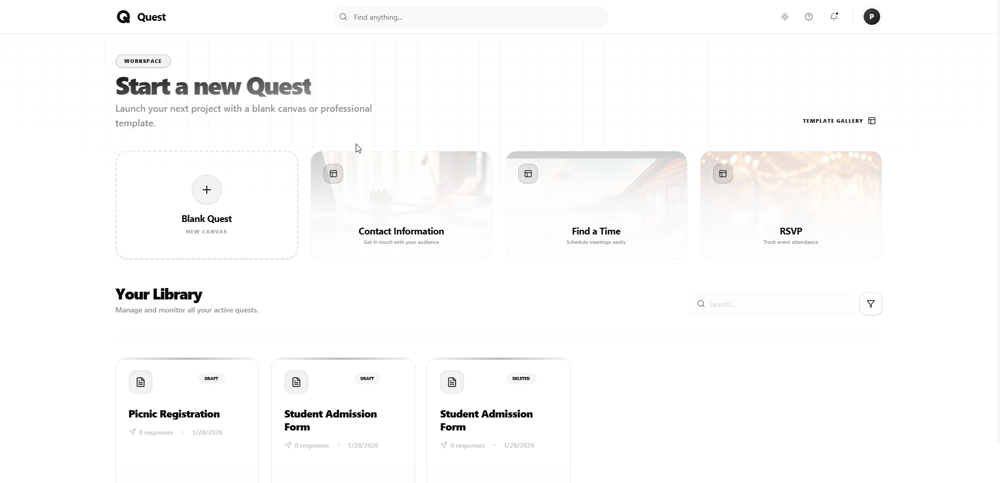
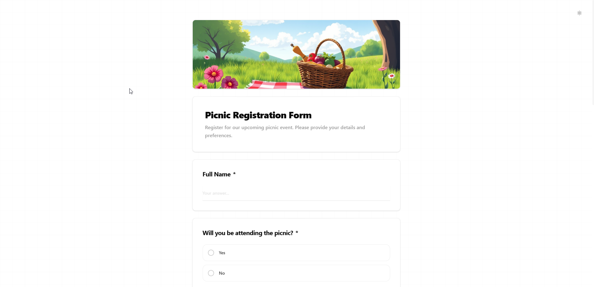
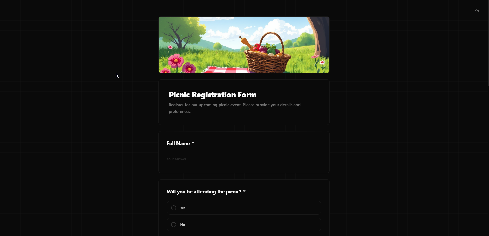
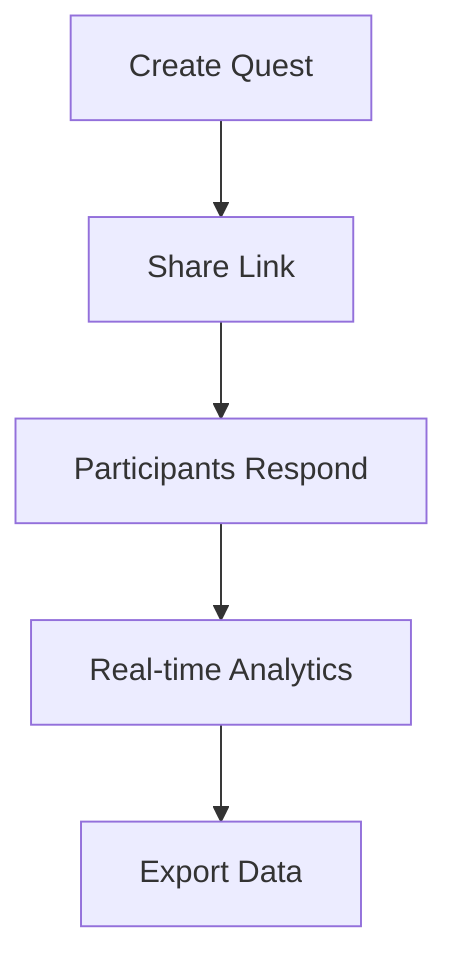

# 🌌 Quest - The Intelligent Form Builder

Quest is a premium, high-performance form builder designed for researchers, marketers, and developers. Build stunning, interactive surveys, quizzes, and data collection tools with a focus on aesthetics and seamless user experience.


## 📱 App Demo

### Dashboard
| Light Mode | Dark Mode |
|------------|-----------|
|  |  |

### Form
| Light Mode | Dark Mode |
|------------|-----------|
|  |  |

## 🧩 How it Works



## ✨ Features

- **🚀 Professional Editor**: Intuitive drag-and-drop interface for building complex forms in minutes.
- **🧠 AI Powered**: Leverages Google Gemini for smart form generation and analysis.
- **⚡ Real-time Analytics**: Monitor responses and trends as they happen with beautiful charts.
- **🔗 Smart Sharing**: Short urls, custom responder links, and social-ready previews.
- **🛡️ Secure Access**: Limit to one response per user with Google Sign-in integration.
- **📡 Webhook Support**: Automate your workflow by sending data to your own endpoints instantly.
- **🌓 Dark Mode**: Premium dark aesthetic throughout the entire application.

## 🛠️ Technology Stack

- **Framework**: [Next.js 15+](https://nextjs.org/)
- **AI Engine**: [Google Gemini (AI SDK)](https://sdk.vercel.ai/)
- **Styling**: [Tailwind CSS 4](https://tailwindcss.com/)
- **Database**: [Prisma](https://www.prisma.io/) with PostgreSQL
- **Auth**: [Better-Auth](https://better-auth.com/)
- **UI Components**: [Radix UI](https://www.radix-ui.com/), [Framer Motion](https://www.framer.com/motion/), & [Lucide Icons](https://lucide.dev/)
- **Runtime**: [Bun](https://bun.sh/)

## 🚀 Getting Started

### Prerequisites

- Node.js / Bun installed
- PostgreSQL database
- Google OAuth credentials
- Google Gemini API Key

### Installation

1. Clone the repository:
   ```bash
   git clone https://github.com/lwshakib/quest-form-builder.git
   cd quest-form-builder
   ```

2. Install dependencies:
   ```bash
   bun install
   ```

3. Set up your environment variables:
   Create a `.env` file based on `.env.example`.

4. Sync the database:
   ```bash
   bun x prisma migrate dev
   ```

5. Start the development server:
   ```bash
   bun dev
   ```

## 🤝 Contributing

Contributions are what make the open source community such an amazing place to learn, inspire, and create. Any contributions you make are **greatly appreciated**.

Please see [CONTRIBUTING.md](CONTRIBUTING.md) for more details.

## ⚖️ License

Distributed under the MIT License. See `LICENSE` for more information.

---

Built with ❤️ by [lwshakib](https://github.com/lwshakib)
