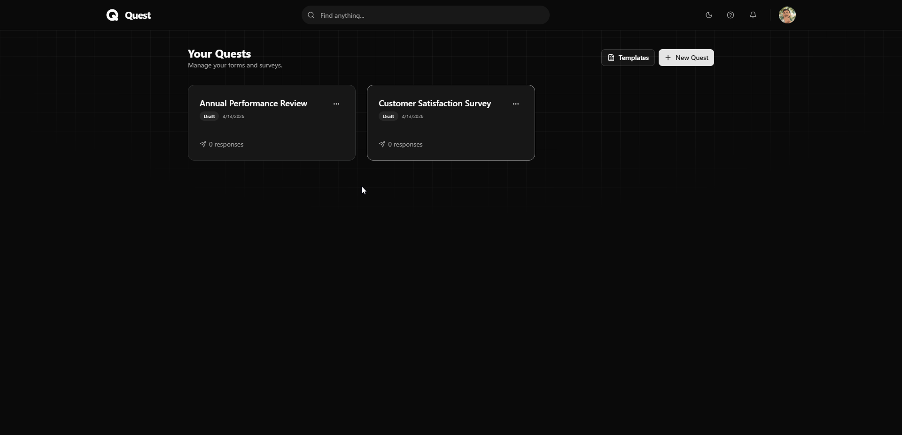
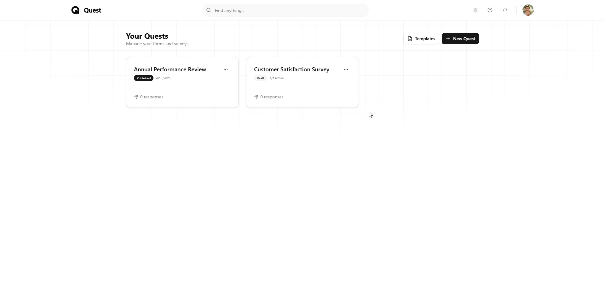
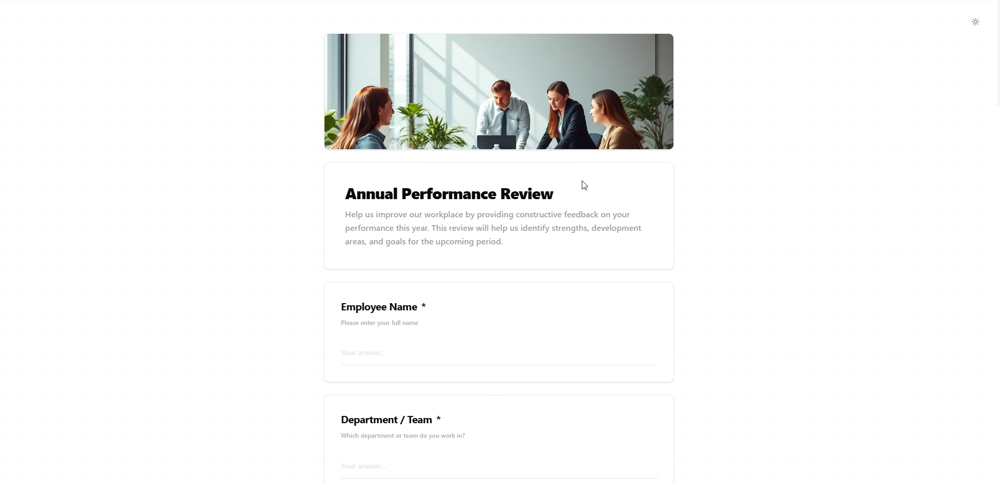
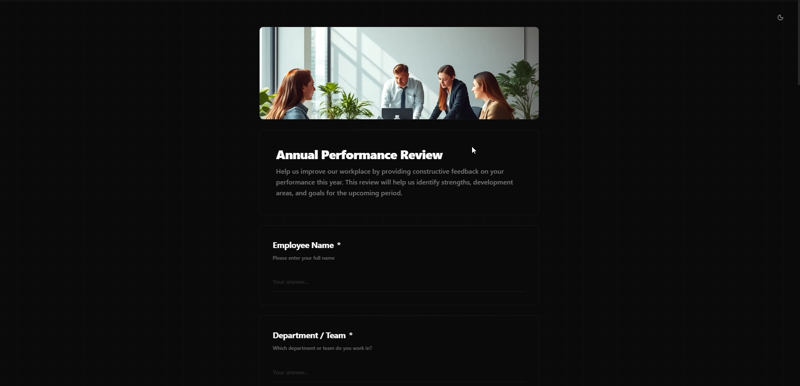
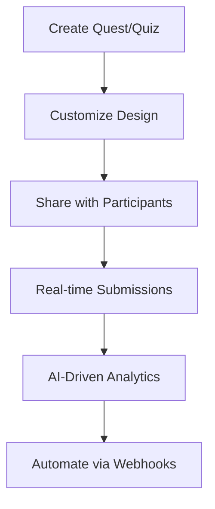

#  Quest - The Intelligent Form Builder

[](https://opensource.org/licenses/MIT)

Quest is a premium, high-performance form builder designed for researchers, marketers, and developers. Build stunning, interactive surveys, quizzes, and data collection tools with a focus on aesthetics, smart automation, and a seamless user experience.

<p align="center">
  
  
</p>

<p align="center">
  
  
</p>

## 🧩 How it Works


```mermaid
graph TD
    A[Create Quest/Quiz] --> B[Customize Design]
    B --> C[Share with Participants]
    C --> D[Real-time Submissions]
    D --> E[AI-Driven Analytics]
    E --> F[Automate via Webhooks]
```

## ✨ Features

- **🚀 Professional Editor**: Intuitive drag-and-drop interface for building complex forms and quizzes in minutes.
- **🧠 AI Powered**: Leverages **Google Gemini 3.1 Flash** for smart form generation and rapid data analysis.
- **🎨 Visual Excellence**: Premium aesthetics with **Tailwind CSS 4**, custom glassmorphism, and smooth **Motion** animations.
- **📊 Advanced Analytics**: Monitor responses and trends as they happen with beautiful **Recharts** integrations.
- **🛠️ Quiz Mode**: Built-in support for graded quizzes with points, correct answers, and instant feedback.
- **🔗 Smart Sharing**: Short URLs, custom responder links, and social-ready previews.
- **🛡️ Secure Access**: Integrated **Better Auth** with Google Sign-in support and response limiting.
- **📡 Webhook Integration**: Automate your workflow by sending data to your own endpoints instantly.
- **🌓 Adaptive Theme**: Seamless light and dark mode support with a focus on high-end dark aesthetics.

## 🛠️ Technology Stack

- **Framework**: [Next.js 16](https://nextjs.org/) (App Router, Server Components)
- **Package Manager**: [pnpm](https://pnpm.io/) (Fast, efficient, and reliable)
- **Database**: [Prisma](https://www.prisma.io/) with PostgreSQL (Hosted on [Neon](https://neon.tech/))
- **AI Engine**: [Google Gemini 3.1 Flash](https://aistudio.google.com/) (Smart orchestration and analysis)
- **Auth**: [Better-Auth](https://better-auth.com/) (Secure, flexible authentication)
- **Styling**: [Tailwind CSS 4](https://tailwindcss.com/), [Radix UI](https://www.radix-ui.com/), & [Motion](https://www.motion.dev/)
- **Media**: [Cloudflare R2](https://www.cloudflare.com/products/r2/) (S3-compatible storage with Signed URLs)
- **Emails**: [Resend](https://resend.com/) & [React Email](https://react.email/)
- **State**: [Zustand](https://docs.pmnd.rs/zustand/getting-started/introduction)

## 🚀 Getting Started

### Prerequisites

- [pnpm](https://pnpm.io/) installed
- PostgreSQL database
- Google OAuth Credentials
- Google Gemini API Key
- Cloudflare R2 Bucket (or any S3-compatible storage)
- Resend API Key

### Installation

1.  **Clone the repository**:

    ```bash
    git clone https://github.com/lwshakib/quest-form-builder.git
    cd quest-form-builder
    ```

2.  **Install dependencies**:

    ```bash
    pnpm install
    ```

3.  **Environment Setup**:
    1. Copy `.env.example` to `.env`:
       ```bash
       cp .env.example .env
       ```
    2. Fill in the required environment variables:
       - `NEXT_PUBLIC_BASE_URL` & `BETTER_AUTH_URL` (usually `http://localhost:3000`)
       - `DATABASE_URL` (your PostgreSQL connection string)
       - `BETTER_AUTH_SECRET` (generate a random string)
       - `GOOGLE_CLIENT_ID` & `GOOGLE_CLIENT_SECRET` (for Google OAuth)
       - `AWS_*` variables (for S3 or Cloudflare R2 bucket)
       - `RESEND_API_KEY` (for email notifications)
       - `CLOUDFLARE_AI_GATEWAY_*` variables (for AI features)
    3. Initialize Bucket: Run the following command once to configure your R2/S3 bucket CORS/policies:
       ```bash
       pnpm run bucket:setup
       ```

4.  **Database Migration**:

    ```bash
    pnpm exec prisma migrate dev
    ```

5.  **Start Development**:
    ```bash
    pnpm run dev
    ```

## 🤝 Contributing

We welcome contributions! Please see [CONTRIBUTING.md](CONTRIBUTING.md) for our development workflow.

## ⚖️ License

Distributed under the MIT License. See `LICENSE` for more information.

---

Built with ❤️ by [lwshakib](https://github.com/lwshakib)
